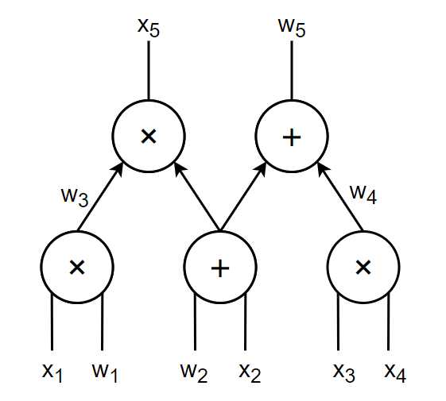

# R1CS和QAP

本文介绍R1CS和QAP这两种算术电路的数学化表示方式，并介绍它们之间的转化关系。

> 文章基于作者的笔记写成，一些地方可能不便于阅读，敬请原谅。我之后会将其打磨成易读的科普/研究入门文章。
> 
> 限于作者目前所学和个人理解，本文内容难免有疏漏和错误，烦请读者朋友指出我的错误，帮助我理解相关知识，在此提前感谢您！
> 
> 联系我：berrychen0w0@163.com

在零知识证明中，计算模型一般是电路，也就是把问题抽象成一个电路表示（关于为什么用电路表示，可以另写一篇来讲讲【偏计算理论的东西 那一篇里面讲吧）【电路还有算术电路和布尔电路的分别，不过这两者是等价的，有转化方法，PAZK书上有提到】。常用的计算模型（电路）有三种。一种是普通的算术电路，它的数学化表示有R1CS和QAP两种，这两种表示本质上是一样的，它们可以轻松地相互转化。第二种是分层电路，它是一种结构很好的算术电路。GKR协议可以是使用分层电路的一个例子【GKR见PAZK书4.6节】。第三种可以称为PLONKish电路，是PLONK协议及其类似协议（例如Halo2等）使用的电路表示方法，它比前两种电路更加灵活，除了加法门和乘法门之外，还可以包括其他的自定义门【我还不太懂，学会了再写一篇文章讲hhh】。

除了PLONK类协议之外，大部分的zkSNARK协议【又是一个专有名词，应该解释一下】都是基于普通算术电路的【应该是吧？】。而要把零知识证明协议应用到电路上，首先又需要把算术电路数学化表示。普通算术电路的数学表示，一般使用R1CS或QAP。可以认为它们提供了两个不同的电路数学化表示的视角，但是这两者本质上是等价的，两者之间的转化也很简单【不过对初学者而言还是有很多细节要搞清楚，我自己就常常绕进去hhh】。本文讨论对普通算术电路的这两种数学表示，及其相互转化。

> 对R1CS和QAP的理解，我接触到的有两种：一种是wlg学长说的，R1CS是矩阵表示，QAP是多项式表示，即我前文说到的两种视角。另一种是Vitalik的文章【https://medium.com/@VitalikButerin/quadratic-arithmetic-programs-from-zero-to-hero-f6d558cea649 】里说的，电路-->R1CS-->QAP这样的数学化表示路径，即R1CS是把电路转化为QAP这种数学表示的中介。中文互联网上大部分讲R1CS和QAP的文章都是基于Vitalik的文章，甚至直接翻译Vitalik的文章的，因此似乎第二种理解更普遍些。
> 我个人的观点，目前倾向于第二种。因为我现在知道的协议都是基于QAP做的，还不知道有什么协议是基于R1CS做的。如果有协议是直接基于R1CS来做，那么似乎第一种理解就更好些。我认为第一种是把R1CS和QAP放在同等地位（即电路转化为R1CS或QAP都行），而第二种是把R1CS视为QAP的前置表示（即电路最终要转化为QAP才行）。

R1CS和QAP都可以看做对算术电路的数学化表示

## 算术电路
【这里说？还是其他文章里说？似乎这里说一下比较好】

电路，是由运算门和电线组成的。在算术电路中，只有加法门和乘法门两种运算门。下图是一个算术电路的例子：

在zkSNARK系统中，电路的输入、输出和中间变量（就是电路中间的连线上的值）都作为变量，这些变量在zkSNARK协议运行时被赋值。所有变量又分为两类，一类是公共输入(public input)，即证明者Prover（后面记为P）和验证者Verifier（后面记为V）都知道的值，记为向量$\mathbf{x}$；另一类是见证(witness)，是只有证明者P知道的值，记为向量$\mathbf{w}$。电路的输入和输出中，可能有些值是public input，有些值是witness；而电路的所有中间变量，一定都是witness。上面的例子中，假设第2,3个输入和第2个输出是witness，可以做如下标注标出所有变量：

注意，由加法门产生的中间变量是不作为变量标注的，加法运算被“包含”在乘法运算之中，这一点我们马上就会看到。但对于加法门产生的电路输出，因为它后面没有乘法门来“包含”这个计算结果了，所以必须标注为一个变量。

现在，我们可以写出这个电路表示的全部约束（注意所有的约束都用乘法表示，把加法作为乘法的一个乘数“包含”到乘法中）：
$$
\begin{aligned}
    x_1 \cdot w_1 &= w_3 \\
    x_3 \cdot x_4 &= w_4 \\
    w_3 \cdot (w_2+x_2) &= x_5 \\
    (w_4 + (w_2+x_2)) \cdot 1 &= w_5
\end{aligned}
$$

注意，因为有一个输出门是加法门，为了用乘法约束关系来表示，我们把它写成了$s\cdot 1$的形式。这个$1$作为一个变量出现在约束中，但是它必须始终被赋值为常数$1$。不妨记这个变量为$v_{one}$，我们要保证$v_{one}=1$始终成立。[^1]

电路中的全部变量写成向量$\mathbf{z}=(v_{one},\mathbf{x},\mathbf{w})=(1,x_1,x_2,x_3,x_4,x_5,w_1,w_2,w_3,w_4,w_5)=:(z_0,z_1,...,z_{10})$

现在，电路已经被改写成若干个乘法等式表示的约束了。接下来，我们看看R1CS和QAP两种约束系统，分别如何形式化地表达这些约束关系。

> **设有n个变量，m个约束（乘法门）。i=1..n, j=1..m**

## R1CS
R1CS是一阶约束系统(rank-1 constaint system)的简写。

【在哪里提出？】【SNARKs for C: Verifying Program Executions Succinctly and in Zero Knowledge(https://eprint.iacr.org/2013/507.pdf) 似乎是这篇13年的文章提出的？不确定】

### 电路转化为R1CS表示

> R1CS可以视作一种矩阵形式（向量内积形式）的表达。$(\sum a_iz_i)\circ(\sum b_i z_i)=(\sum c_i z_i)$​
>
> 【为什么是“向量内积形式”？？】

我们定义三个矩阵$A,B,C$，分别用于表示上述乘法约束关系的左乘数，右乘数，积。矩阵的每一列表示一个变量，每一行表示一个约束条件，$a_{ji}$就表示第$i$个变量在第$j$个约束条件的左乘数中对应的系数，$b_{ji},c_{ji}$同理。于是可以得到三个矩阵如下（第一行只是标注每一列对应的变量以便查看，实际上每个矩阵都是4行11列的）：

$$
    A = \left(
        \begin{matrix}
        [v_{one} & x_1 & x_2 & x_3 & x_4 & x_5 & w_1 & w_2 & w_3 & w_4 & w_5] \\
        0 & 1 & 0 & 0 & 0 & 0 & 0 & 0 & 0 & 0 & 0 \\
        0 & 0 & 0 & 1 & 0 & 0 & 0 & 0 & 0 & 0 & 0 \\
        0 & 0 & 0 & 0 & 0 & 0 & 0 & 0 & 1 & 0 & 0 \\
        0 & 0 & 1 & 0 & 0 & 0 & 0 & 1 & 0 & 1 & 0 \\
        \end{matrix}
    \right)
    \\
    B = \left(
        \begin{matrix}
        [v_{one} & x_1 & x_2 & x_3 & x_4 & x_5 & w_1 & w_2 & w_3 & w_4 & w_5] \\
        0 & 0 & 0 & 0 & 0 & 0 & 1 & 0 & 0 & 0 & 0 \\
        0 & 0 & 0 & 0 & 1 & 0 & 0 & 0 & 0 & 0 & 0 \\
        0 & 0 & 1 & 0 & 0 & 0 & 0 & 1 & 0 & 0 & 0 \\
        1 & 0 & 0 & 0 & 0 & 0 & 0 & 0 & 0 & 0 & 0 \\
        \end{matrix}
    \right)
    \\
    C = \left(
        \begin{matrix}
        [v_{one} & x_1 & x_2 & x_3 & x_4 & x_5 & w_1 & w_2 & w_3 & w_4 & w_5] \\
        0 & 0 & 0 & 0 & 0 & 0 & 0 & 0 & 1 & 0 & 0 \\
        0 & 0 & 0 & 0 & 0 & 0 & 0 & 0 & 0 & 1 & 0 \\
        0 & 0 & 0 & 0 & 0 & 1 & 0 & 0 & 0 & 0 & 0 \\
        0 & 0 & 0 & 0 & 0 & 0 & 0 & 0 & 0 & 0 & 1 \\
        \end{matrix}
    \right)
$$

这样，电路的约束条件就可以表示成一个矩阵乘法等式：
$$
\begin{equation}
    (A\cdot \mathbf{z}) \circ (B\cdot \mathbf{z}) = (C\cdot \mathbf{z})
\end{equation}
$$
其中$\circ$是圈乘/哈达玛积(Hadamard product)，表示两个矩阵对应位置的元素乘起来。

这样我们就得到了电路转化为R1CS的形式。(1)式就是一个R1CS

### R1CS的形式化定义
【？？？】【一个N变量，M乘法门的电路，表示成(1+N)\times M的矩阵？？】

这里给出中文综述[^3]中的定义：

对应本文的内容来看，$z=(io,1,w)^T$中$io$相当于前文的$x_1,...,x_5$，$w$相当于$w_1,...,w_5$，$1$就是前文的$v_{one}=1$。若按照我们前文所写，假设有$n$个变量，$m$个约束（乘法门），则电路转化为一个R1CS：$(\mathbb{F}, A, B, C, \mathbf{z}=(v_{one},\mathbf{x},\mathbf{w}))$。其中$A,B,C$都是$m\times (1+n)$的矩阵，$\mathbf{z}$是长为$1+n$的向量。

> 这里有一个小细节待考证：R1CS的矩阵A,B,C必须是方阵（如中文综述定义），还是说可以是$m\times (1+n)$这种一般矩阵（很多网络文章，包括V神的科普文，都不是方阵）？
>
> 不过这个细节不影响总体的理解。

### 基于R1CS构建的zkSNARK

【zk mooc lec9 52/57】Bulletproof等，用IPA的

## QAP
QAP可以视作一种多项式形式的表达。

### 电路转化为QAP表示
我们把每个约束条件（也就是每个乘法门）对应到一个随机的域元素上，令第$j$个约束条件对应到$r_j \overset{\$}{\leftarrow} \mathbb{F}$。定义若干个多项式$l_i(X), r_i(X), o_i(X)$，其中$l_i(X)$对应变量$z_i$，令$l_i(r_j)$表示变量$z_i$在第$j$个约束条件（第$j$个乘法门）中是否作为左输入。如果是，则$l_i(r_j)=1$；如果不是，$l_i(r_j)=0$。$r_i(X), o_i(X)$同理。

对上面的例子而言，我们就可以得到多项式$l_0(X),l_1(X),...,l_{10}(X)$​​如下：

|         | $l_0(X)$ | $l_1(X)$ | $l_2(X)$ | $l_3(X)$ | $l_4(X)$ | $l_5(X)$ | $l_6(X)$ | $l_7(X)$ | $l_8(X)$ | $l_9(X)$ | $l_{10}(X)$ |
| ------- | -------- | -------- | -------- | -------- | -------- | -------- | -------- | -------- | -------- | -------- | ----------- |
| $X=r_1$ | 0        | 1        | 0        | 0        | 0        | 0        | 0        | 0        | 0        | 0        | 0           |
| $X=r_2$ | 0        | 0        | 0        | 1        | 0        | 0        | 0        | 0        | 0        | 0        | 0           |
| $X=r_3$ | 0        | 0        | 0        | 0        | 0        | 0        | 0        | 0        | 1        | 0        | 0           |
| $X=r_4$ | 0        | 0        | 1        | 0        | 0        | 0        | 0        | 1        | 0        | 1        | 0           |

另外$r_i(X), o_i(X)$如下：

|         | $r_0(X)$ | $r_1(X)$ | $r_2(X)$ | $r_3(X)$ | $r_4(X)$ | $r_5(X)$ | $r_6(X)$ | $r_7(X)$ | $r_8(X)$ | $r_9(X)$ | $r_{10}(X)$ |
| ------- | -------- | -------- | -------- | -------- | -------- | -------- | -------- | -------- | -------- | -------- | ----------- |
| $X=r_1$ | 0        | 0        | 0        | 0        | 0        | 0        | 1        | 0        | 0        | 0        | 0           |
| $X=r_2$ | 0        | 0        | 0        | 0        | 1        | 0        | 0        | 0        | 0        | 0        | 0           |
| $X=r_3$ | 0        | 0        | 1        | 0        | 0        | 0        | 0        | 1        | 0        | 0        | 0           |
| $X=r_4$ | 1        | 0        | 0        | 0        | 0        | 0        | 0        | 0        | 0        | 0        | 0           |

|         | $o_0(X)$ | $o_1(X)$ | $o_2(X)$ | $o_3(X)$ | $o_4(X)$ | $o_5(X)$ | $o_6(X)$ | $o_7(X)$ | $o_8(X)$ | $o_9(X)$ | $o_{10}(X)$ |
| ------- | -------- | -------- | -------- | -------- | -------- | -------- | -------- | -------- | -------- | -------- | ----------- |
| $X=r_1$ | 0        | 0        | 0        | 0        | 0        | 0        | 0        | 0        | 1        | 0        | 0           |
| $X=r_2$ | 0        | 0        | 0        | 0        | 0        | 0        | 0        | 0        | 0        | 1        | 0           |
| $X=r_3$ | 0        | 0        | 0        | 0        | 0        | 1        | 0        | 0        | 0        | 0        | 0           |
| $X=r_4$ | 0        | 0        | 0        | 0        | 0        | 0        | 0        | 0        | 0        | 0        | 1           |

由上面这些$r_1,...,r_4$点上的取值，我们可以插值（常用Lagrange多项式插值法）得到$l_i(X),r_i(X),o_i(X), i=0,1,...,10$这些多项式的表达式。它们都是3次多项式（因为是由4个定点插值得到）。现在我们定义多项式$L(X)$：
$$
    L(X) = \sum_{i=0}^{10} z_i\cdot l_i(X)
$$
类似可定义$R(X),O(X)$。$L(X),R(X),O(X)$称为selector polynomial【zk mooc lec9中给的命名】。可以看到$L(r_j)=\sum z_i\cdot l_i(r_j)=第j个乘法门的左输入$。例如$L(r_4)=z_2+z_7+z_9=(x_2+w_2+w_4)$。则第$j$个约束条件（第$j$个乘法门）对应可以写为多项式关系$L(r_j)R(r_j)=O(r_j)$。

定义master polynomial为
$$
p(X) = L(X)R(X)-O(X) = (\sum z_i\cdot l_i(X))(\sum z_i\cdot r_i(X))-(\sum z_i\cdot o_i(X))
$$
则电路的全部约束条件，就转化为“$p(X)$在$r_j,j=1,...,4$上取值都为0”，即$\{r_j\}$是$p(X)$的零点。这意味着$(X-r_j)$是$p(X)$的因式。定义vanishing polynomial：
$$
    V(X) = \sum_j (X-r_j)
$$
则$V(X)$应当是$p(X)$的因式。即存在多项式$q(X)$使得$p(X)=V(X)q(X)$。我们称$\displaystyle q(X)=\frac{p(X)}{V(X)}$​为商多项式(quotient polynomial)

这样，我们得到了电路约束转化为QAP的形式：
$$
\begin{equation}
	p(X)=\left(\sum z_i\cdot l_i(X)\right)\cdot\left(\sum z_i\cdot r_i(X)\right)-\left(\sum z_i\cdot o_i(X)\right) = V(X)q(X)
\end{equation}
$$
(2)式就是一个QAP。

### QAP的形式化定义

QAP是在[GGPR13] [^2]中提出的。论文中给出的QAP的形式化定义如下：

### 基于QAP构建的zkSNARK
【ZK MOOC LEC9，应该给出了】大量的zkSNARK协议都是基于QAP构建的，例如Pinocchio, Groth16等等。

## R1CS转QAP
前面已经看到，R1CS和QAP是算术电路的两种不同的数学化表示。这两种表示方式应当是等价的。这一节给出R1CS到QAP的转化。

设电路有$n$个变量，$m$个约束（乘法门），则其R1CS有$A,B,C$三个$m\times (1+n)$的矩阵，$\mathbf{z}$是长为$(1+n)$的向量：
$$
(A\cdot \mathbf{z}) \circ (B\cdot \mathbf{z}) = (C\cdot \mathbf{z})
$$

> 回顾：$a_{ji}$表示第$i$个变量在第$j$个约束条件的左乘数中对应的系数，$b_{ji},c_{ji}$同理

我们把$A$的每一列插值为一个多项式：对第$i$列，$a_{ji}$表示多项式$a_i(X)$在$r_j\overset{$}{\leftarrow}\mathbb{F}$点的取值$a_i(r_j)$。于是$A$变成$\bar{A}=(a_0(X),...,a_n(X))$，此时$\bar{A}\cdot\mathbf{z}=\sum_{i} l_i(X)\cdot z_i$就是QAP中的$L(X)$。对$B,C$做相同插值操作，则
$$
(\bar{A}\cdot\mathbf{z})\cdot(\bar{B}\cdot\mathbf{z})-(\bar{C}\cdot\mathbf{z})=V(X)q(X)
$$
就是转化得到的QAP

## related work

网上能找到挺多关于R1CS和QAP的文章，例如V神的文章[Quadratic Arithmetic Programs: from Zero to Hero](https://medium.com/@VitalikButerin/quadratic-arithmetic-programs-from-zero-to-hero-f6d558cea649)就比较经典。中文互联网上关于R1CS和QAP的文章，大多也是参照V神的这篇写的（例如https://snowolf0620.xyz/index.php/zkp/435.html）。但是，我认为V神文章中写的“问题->电路->R1CS->QAP”的转化逻辑并非zkSNARK构建的一般逻辑。

更好的理解是，把R1CS和QAP理解为电路的两种不同的数学化表示方式（矩阵/向量内积形式和多项式恒等形式），不同的零知识证明协议需要基于不同的表示（R1CS或QAP）【例如？什么协议对应什么表示？】运行。至于R1CS到QAP的转化，只是表明这两种表示方法的等价性，并不是说每个电路都要先转化为R1CS再最终转化为QAP。实际上，本文中就是直接从电路得到QAP，并不需要R1CS作为中间环节。

本文和网上常见文章的另一个不同在于，本文是从电路出发转化为R1CS和QAP，而不是从一个程序出发。事实上，从程序到电路有一些专门的通用转化工具（例如TinyRAM），而且真实应用场景中的程序远比一个$x^3+x+5$复杂得多。本文直接从抽象的电路模型出发，更方便理解电路到R1CS/QAP等数学化表示的转化逻辑，且不会和“程序->电路”这一步发生混淆【程序->电路可以单独写一篇？】

## R1CS和QAP的关系 相关材料

这两篇都是比较深入的材料，跟一般科普文不一样

【这是一个很好的材料，比较理论，跟网上常见的不一样】https://aping-dev.com/index.php/archives/425/

https://crypto.stackexchange.com/questions/88466/construction-of-r1cs-vs-qap

## 其他

* 关于QAP，如何计算$l_i(X), p(X), q(X)$等的效率问题，在[GGPR13]的[15/59] (p14)最下面起，讨论了这些问题

## 脚注

[^1]: $v_{one}$的记法是参照Why and How zkSNARKs work【插连接】文章
[^2]: 【GGPR13论文引用】
[^3]: 《简洁非交互零知识证明综述》