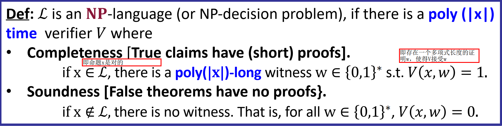
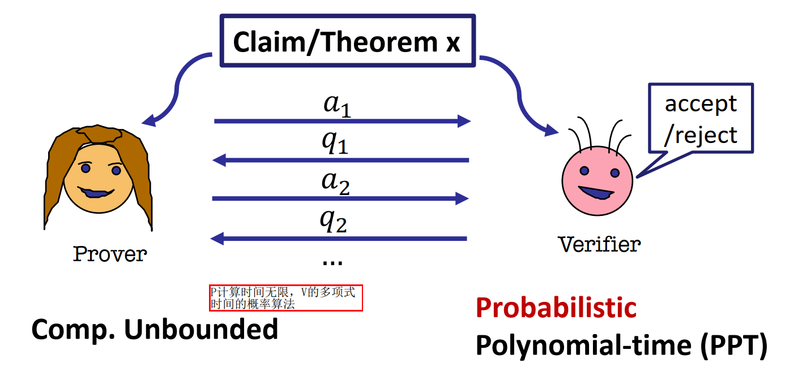
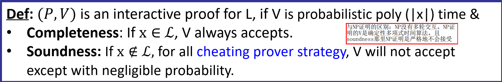

【看PAZK书写？PCP定理在计算理论书上也有】

【IP类是knowledge complexity论文里定义的诶】

## IP类

### 从NP到IP

IP(Interactive Proofs)类是knowledge complexity论文[^1]里提出的，是对NP的一个扩展。

我们知道，P是多项式时间可解的问题类，NP是多项式时间可验证的问题类。计算理论书[^2]上对NP类的定义是：

【待补充】【大概是，存在一个witness，使得多项式时间内可以验证它是问题的解？】

可是如果我们把NP视作一个证明系统，假设其中存在两方，证明者Prover和验证者Verifier，由Prover给Verifier提供witness，Verifier负责验证witness是否满足问题。则NP可以定义如下【zk mooc lec1】：

这里Prover(P)是无限算力的，Verifier(V)是多项式时间的。

这个NP的定义中，P和V只有一次交互，即P提供witness给V。如果我们引入多轮交互，即：

V经过与P的多轮交互后，最终判定接受还是拒绝，即$V(a_1,q_1,...)=1还是0$。这里P仍然是无限算力的，V是多项式时间的。

下面给出IP的正式定义：

注：IP除了在NP基础上引入了交互式之外，还引入了随机性。即IP是概率性证明(probablistic proof)，存在一个极小的概率（可忽略的概率），使P骗过V让V接受了一个错误的陈述。而NP是确定性证明，V一定不会接受一个错误的陈述。

### NP$\subset$​​IP（？）

任意NP问题可以看做一轮交互的IP问题，所以显然NP$\subseteq$IP。而IP在NP基础上引入交互和随机性之后，“节约”了V的工作量（计算量），使得IP（可能）可以证明的问题多于NP，即IP的证明能力（可能）大于NP。下面用“图不同构(Graph Non-Isomorphism)”这个问题为例来说明。

图不同构问题：给定两个图$G_1,G_2$，要判断$G_1$和$G_2$是否不同构。

如果用NP来证明两个图不同构，需要V验证所有可能的$G_1$到$G_2$的映射，判断每一个映射都不是同构映射，才能判定图不同构。此时witness应该是$G_1$到$G_2$所有可能的映射，假设图是$n$个顶点的图，则witness共有$n!$个映射，大小是$O(n!)$级。V要检验每一个映射都不是同构映射，至少要读取整个witness，需要$O(n!)$时间。这不是一个PPT的V能够做到的。所以图不同构问题（可能）不属于NP类【目前尚未找到PPT验证图不同构的方法，所以图不同构目前认为可能不属于NP类（但是不能就说图不同构不属于NP类）】。

而如果使用IP来证明，则可以有PPT的V：

* V随机选择$i\overset{$}{\leftarrow}\{1,2\}$，构造一个图$G\cong G_i$，同构映射为$\sigma$（即$\sigma(G_i)=G$），把$G$发送给P
* P判定$G$和$G_1$同构还是和$G_2$同构，如果和$G_1$同构，则发送$b=1$给V；如果和$G_2$同构，则发送$b=2$给V
* V检查$b\overset{?}{=}i$，如果$b\neq i$，则拒绝

在这个过程中，如果$G_1$和$G_2$不同构，则P应该能够准确判断出$i$是多少，令$b=i$发送给V；否则如果两图同构，则$G$和$G_1,G_2$都同构，P只能从$1,2$中猜一个值赋值给$b$，于是有$1/2$的概率猜错而被拒绝。

把上述步骤重复$k$次，若总有$b=i$，则此时P骗过V的概率为$1/2^k$，是非常小（可忽略）的了。于是V可以接受证明。

这个IP中，V只需要做$k$次“构造一个同构的图”和$k$次“验证两个值相等”。构造同构的图是$O(n)$的，验证相等是$O(1)$的，于是V是$O(kn)=O(n)$的。（$k$是根据安全参数确定的一个常数）。所以，图不同构问题属于IP类。

这个图不同构的例子表明，IP类可能大于NP类。

### P,NP,IP一点理解

可以认为从P到NP到IP，逐次降低时间的一个指数级？P中是多项式时间可解的问题，而一些多项式时间不可解的（指数级可解的）问题，则用NP，相当于由一个“外人”来解，然后把答案(witness)给我验证，这样可以降低到poly时间。更进一步，有的问题验证都需要指数时间（例如\#SAT问题、图不同构问题），此时用IP，有一个P不仅帮我把答案求出来，还帮我计算验证答案的过程中需要的一些数据，从而进一步节省V验证答案的时间，到poly级。【这个理解太粗糙了：难道只有多项式时间和指数时间两种时间？指数时间的问题一定只会降低为poly时间吗？一个poly时间的NP/IP对应到P/NP上一定是指数时间的问题吗？】

## PCP定理

TODO

## reference

[^1]: The Knowledge Complexity of Interactive Proof Systems
[^2]: 计算理论导引